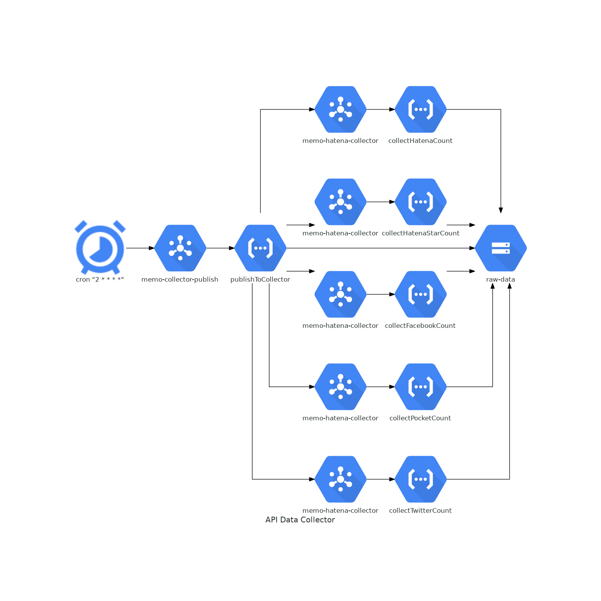
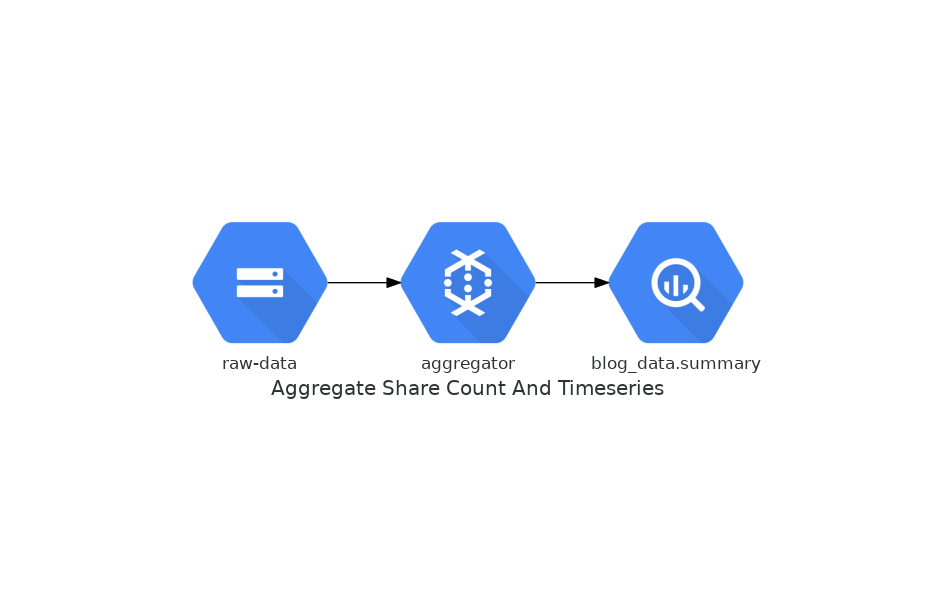
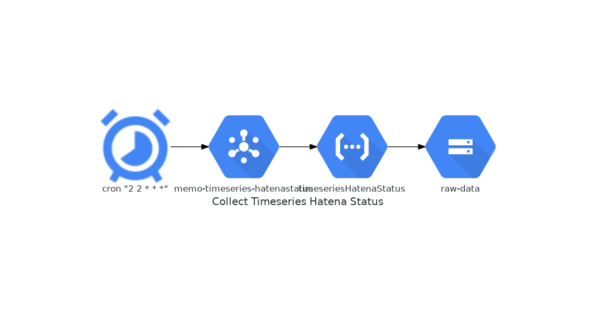

# shared count collector

## Architecture

### API Data Collector



### Aggregate Share Count And Timeseries



### Collect Timeseries HatenaStatus




## directory
- hatena
- hatenastar
- facebook
- pocket
- twitter
- publisher
    - 各種functionへのmessage publishする関数
- aggregator
    - GCS to BQ with dataflow
        - aggregator.py 各種サービスのシェアカウントをサマリーしBQへ
        - timeseries.py 各種時系列データをサマリーしBQへ
- timeseries-hatenastatus
    - hatenaブログの購読者数、記事数を定点観測

article url * service の単位でシェア数を取得するFunction

## requirements
### GCS bucket
- 事前に作っておく
- production
    - 'memo-raw-data'
- development
    - 'dev-memo-raw-data'

```
TODO: gcloudで
```

### Pub/Sub Topic

```
gcloud pubsub topics create memo-collector-twitter
```

### API
- Twitter
    - 事前にデータを収集するよう申請する(https://jsoon.digitiminimi.com/)
- haetna
    - bookmark API
- hatenastar
    - star API
- Facebook
    - graph API
- Pocket
    - scraping...

## development

- environment

環境変数の設定が必要

| name | description |
|:-|:-|
| GOOGLE_APPLICATION_CREDENTIALS | credentialファイルのパス |
| BUCKET | テストで使用するバケット名 |


- start server

BUCKETは開発で使うストレージのバケット名

```
cd twitter
npm ci
export BUCKET=dev-memo-raw-data
npx functions-framework --target=collectTwitterCount --signature-type=event
```

- event.json

```
{
  "url": "https://swfz.hatenablog.com/entry/2019/03/03/233624",
  "service": "twitter"
}
```

- 確認

```
curl -XPOST -H 'Content-Type:application/json; charset=utf-8' -d "{\"data\": {\"data\": \"$(cat event.json|base64|tr -d '\n')\"}}" http://localhost:8080/
```


## deploy

BUCKETは任意のバケット名

```
cd twitter
gcloud functions deploy collectTwitterCount --trigger-topic=memo-collector-twitter --runtime nodejs10 --region asia-northeast1 --set-env-vars BUCKET=memo-raw-data
```

## publish message

```
gcloud pubsub topics publish memo-collector-twitter --message '{"url":"https://example.com","service":"twitter"}'
```

